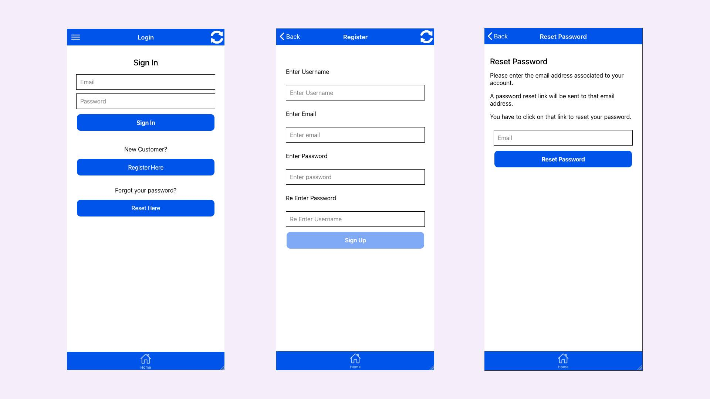

# 🔐 WordPress WooCommerce Mobile Auth (Login, Register, Reset) with Ionic and Angular

A complete open-source authentication system for mobile apps using **Ionic**, **Angular**, **WooCommerce**, and **WordPress REST API**. This project supports:

✅ Login  
✅ Customer registration  
✅ Password reset (custom WordPress REST API extension)

Built specifically for **hybrid and mobile apps** powered by **WooCommerce**.

---

## 🌟 Features

- ✅ Login with WordPress/WooCommerce credentials
- ✅ Register user as WooCommerce customer
- ✅ Reset password via mobile using custom API endpoint
- ✅ Uses JWT for secure auth
- ✅ Built on Ionic + Angular
- ✅ Easy to integrate and extend

---

## 🛠️ Tech Stack

- Ionic Framework
- Angular
- WordPress REST API
- WooCommerce REST API
- JWT Authentication plugin

---

## 📱 Use Cases

- WooCommerce-powered mobile apps
- Headless WordPress authentication
- Customer management via mobile
- Hybrid eCommerce apps with login + register + reset flows

---

## 🧑‍💻 Installation

```bash
git clone https://github.com/yourusername/woocommerce-auth-ionic-angular.git
cd woocommerce-auth-ionic-angular
npm install
ionic serve
```
## Screenshot


   
## 🙌 Author

**M A Hasan**  
🌐 [https://hasan.online](https://hasan.online)


## ⭐ Support This Project

If you find this useful:
- ⭐ Star the repository on GitHub
- 🔗 Share it with fellow Ionic, WordPress, WooCommerce, or mobile app developers
- 💡 Contribute with feedback or pull requests

> Together, we make WordPress more mobile-friendly and developer-first 🚀
